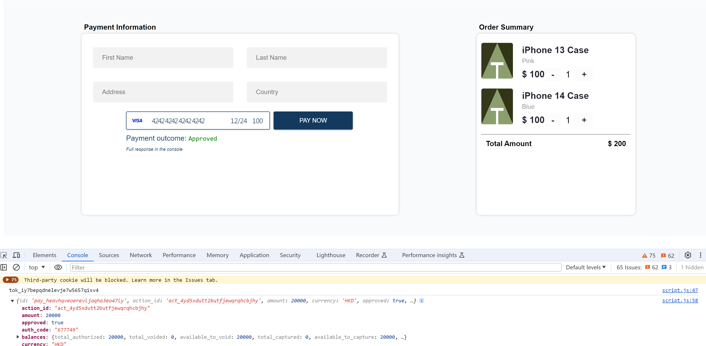

1. Clone the repository
2. Open a terminal, run `npm i` to install the dependencies
3. Run `npm start` to start the server
4. Open a browser and go to `http://localhost:4242/`
5. Use test card number `4242 4242 4242 4242` with a future expiry month/year and CVV = `100` to test
6. The test result would be like this
   
